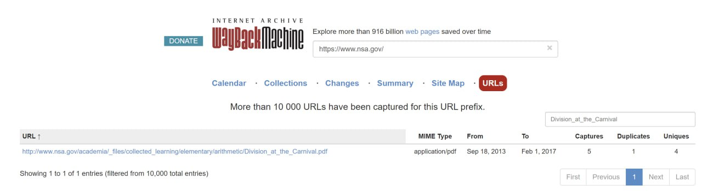
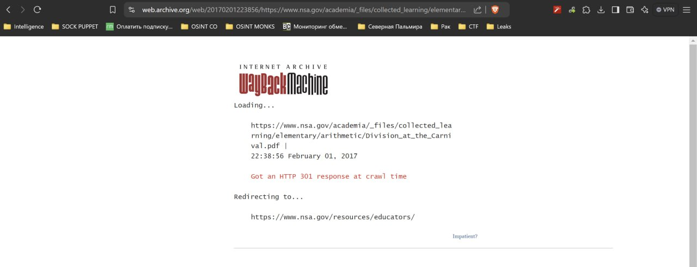
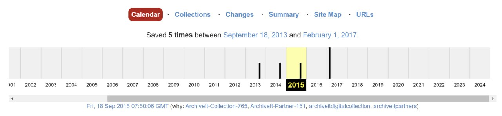
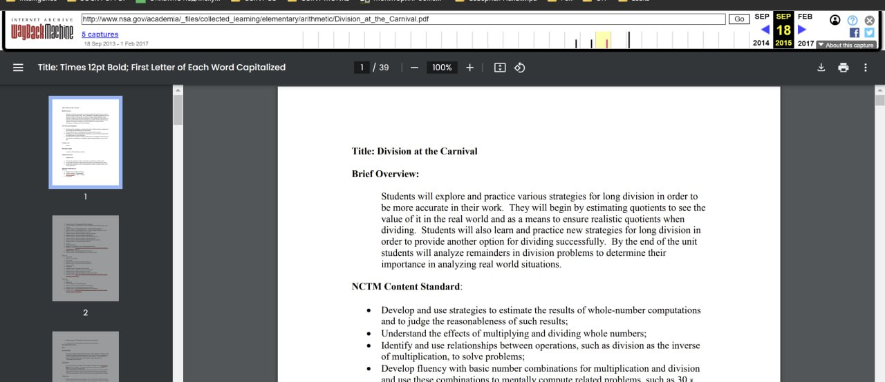
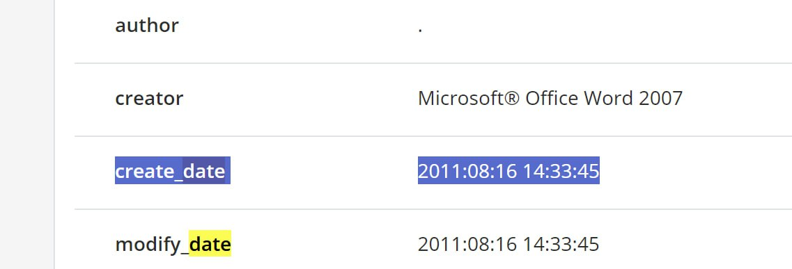

# MCTF Task: [Северная Пальмира] i found you

### Описание

**RU:**
Ха! Пароль найден, оказывается Хакер работает на NSA!!! Теперь нам нужно понять, когда конкретно он являлся сотрудником этой могущественной организации. Используя подсказки из первого таска найдите время создания рабочего файла, о котором говорится в флаге первого таска.

**EN:**
Ha! Password found, it turns out Hacker works for the NSA!!! Now we need to figure out when exactly he was an employee of this powerful organization. Using the clues from the first challenge, find the time of creation of the working file mentioned in the flag of the first challenge.

**Format:** MCTF{xxxx:xx:xx xx:xx:xx}

### Writeup
В WaybackMachine вбивается сайт NSA.gov и ищется файл с названием `Division_at_the_Carnival`



Самый новый результат нам не подходит



Идем в 2015 и пытаемся открыть там



Открывается, радуемся :)



Теперь нам нужно это скачать и извлечь оттуда мета-дату:
```
create_date
2011:08:16 14:33:45
```



### Flag
```
MCTF{2011:08:16 14:33:45}
```