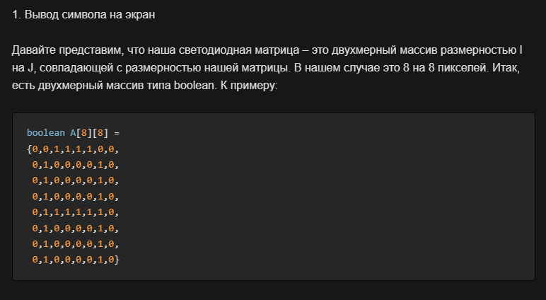

# Writeup

Заходим в IDA, осматриваемся и видим это:


Манипуляции с байтами нас ни к чему не проводят, осматриваемся дальше, видим интересные функции:

```
LedControl::spiTransfer()
LedControl::clearDisplay()
```

Эти функции принадлежат библиотеке для работы со свитодиодными матрицами. Делаем вывод, что на матрицу выводится флаг.
Открываем какую-нибудь статью про работы с матрицами и смотрим, как происходит вывод символа на экран:



Вытаскиваем байты флага и превращаем в удобочитаемый вид:

```python
def byte_to_stars_and_spaces(byte):
    return ''.join('*' if bit == '1' else ' ' for bit in f"{byte:08b}")

# Get flag data from binary
def main():
    flag = [
        [0, 0x44, 0x6C, 0x54, 0x44, 0x44, 0x44, 0],
        [0, 0x38, 0x44, 0x40, 0x40, 0x44, 0x38, 0],
        [0, 0x7C, 0x10, 0x10, 0x10, 0x10, 0x10, 0],
        [0, 0x3C, 0x20, 0x38, 0x20, 0x20, 0x20, 0],
        [0x18, 0x10, 0x10, 0x20, 0x10, 0x10, 0x18, 0],
        [0, 8, 8, 8, 0x38, 0x28, 0x38, 0],
        [0, 0x28, 0x28, 0x38, 8, 8, 8, 0],
        [0, 0x44, 0x6C, 0x54, 0x44, 0x44, 0x44, 0],
        [0, 0x20, 0x3C, 0x24, 0x24, 0x24, 0x24, 0],
        [0, 0, 0, 0, 0, 0, 0x7E, 0],
        [0, 0x10, 0x28, 0x44, 0x7C, 0x44, 0x44, 0],
        [0, 0x2C, 0x34, 0x20, 0x20, 0x20, 0x20, 0],
        [0, 0x70, 0x48, 0x44, 0x44, 0x48, 0x70, 0],
        [0, 0x44, 0x44, 0x44, 0x44, 0x44, 0x38, 0],
        [0, 0x10, 0, 0x10, 0x10, 0x10, 0x10, 0],
        [0, 0x42, 0x62, 0x52, 0x4A, 0x46, 0x42, 0],
        [0x38, 0x44, 0x44, 0x44, 0x44, 0x44, 0x44, 0x38],
        [0x30, 0x10, 0x10, 8, 0x10, 0x10, 0x30, 0]
    ]

    for i in range(8):
        for j in range(18):
            if j == 17:
                print(byte_to_stars_and_spaces(flag[j][i]))
            else:
                print(byte_to_stars_and_spaces(flag[j][i]), end='')


if __name__ == "__main__":
    main()
```

Результат:

