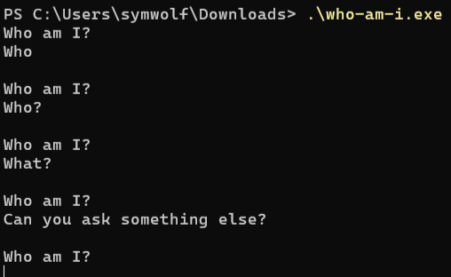
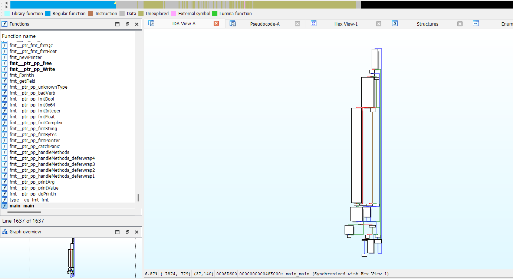
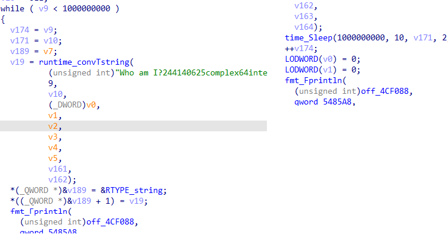
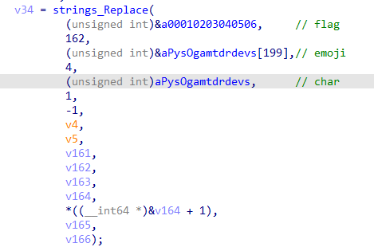
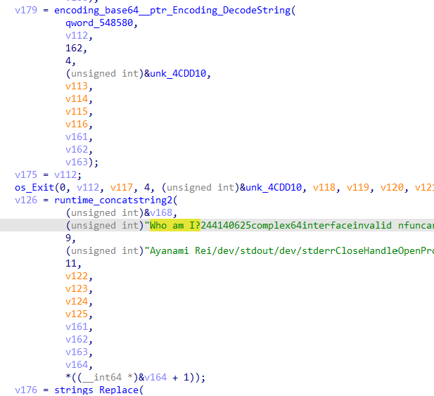

# who-am-i

## Description

Who am I? Who am I? Who am I? Who am...

## Writeup

Running the executable, we see that we are asked the same question

Opening executable in disassembler & jump to `main_main` function

After a little research, we see that solving the task “fairly” will not work, as it will take about 32 years to solve it

As we investigate further, we see many substitutions in one of the lines

After replacing all emoji in the flag with char's, we get base64

`OgsbBxYQDzQmVRxSMgcdMTYWEVsPDAQOHgtSXxw=`

Then we need to decode base64 & xor it with `Who am I?` & `Ayanami Rei` concatenated

## Flag

`mctf{Y0u_4r3_nOT_Ay4naM1_r31}`

## Author

По всем вопросам - @xenonco