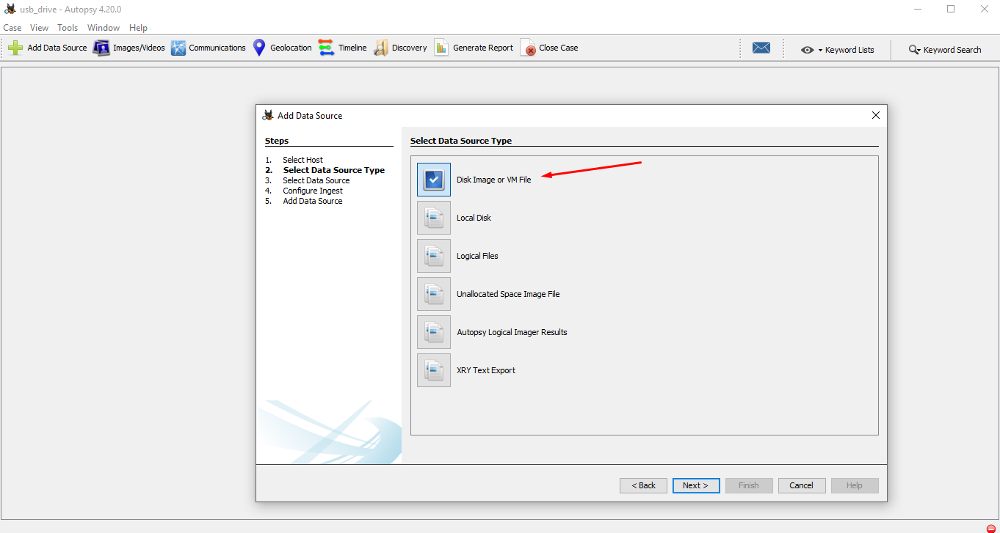
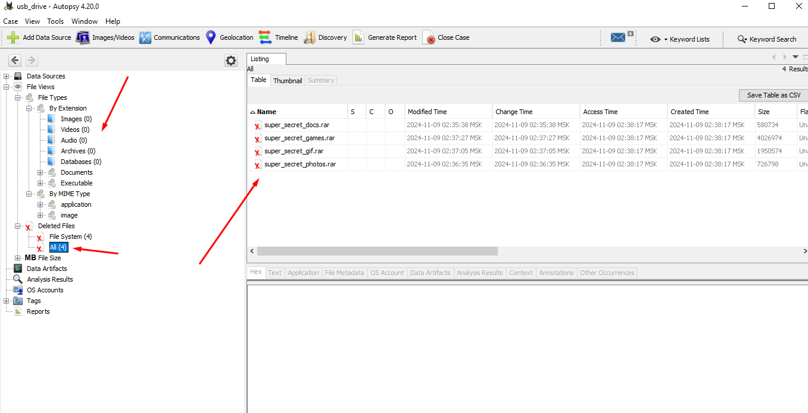
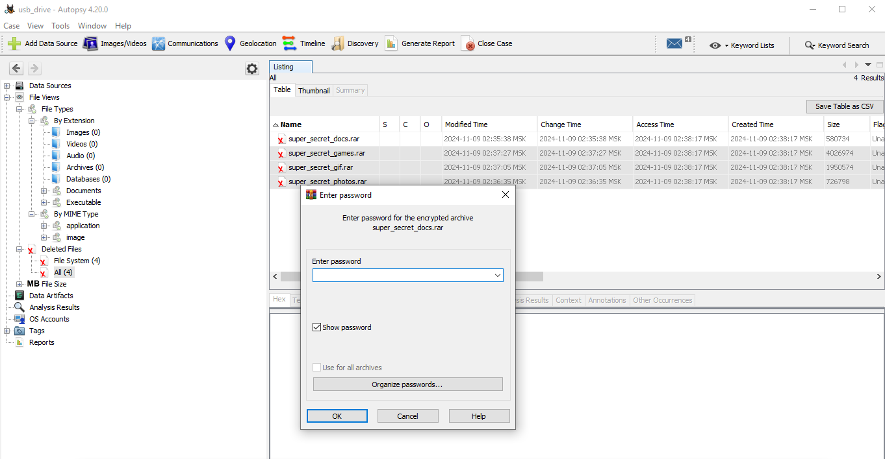
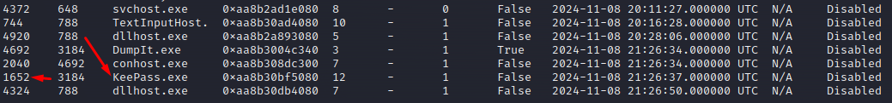
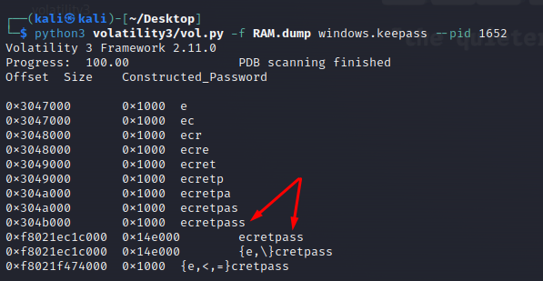
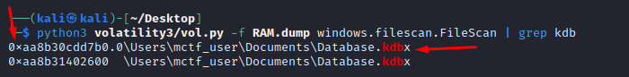
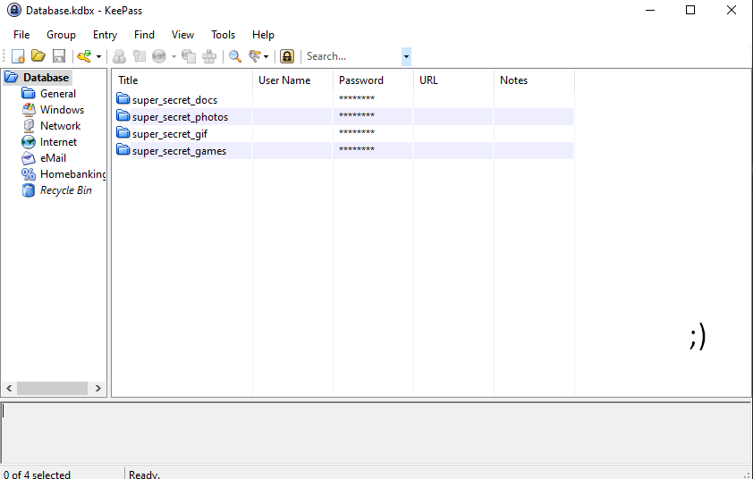

# Paranoid | Forensic | Medium 

## Описание 
Ох, да как он надоел со своей вечной паранойей! Что такого можно скрывать настолько тщательно...

__RAM MD5:__ `D45B26E76853AD136B45F22949943942`

__RAM:__ https://disk.yandex.ru/d/ZJUbnbxkmh88fg

__DD MD5:__ `3975277DADC240BA33FF07C8BCC53A6F`

__DD:__ https://disk.yandex.ru/d/5NCzukuIWs0qgw

# Administration
## Info

Выдать игрокам sсылки на артефакты
## Решение 

Нам дан дамп оперативной памяти и побитовая копия чьей-то флешки. Так же мы знаем что где-то там спрятаны интересные для нас данные.

Начнем расследование с образа флешки, так как он меньше и в нем, вероятно, легче будет накопать что-то интересное. Для анализа воспользуемся [Autopsy](https://www.autopsy.com/), создадим новое "Дело" и добавим образ флешки как источник улик. 



Как только приложение обработает источник улик, посмотрим поближе, что он нашел. Обратим внимание, что он не нашел никаких файлов по их сигнатурам (изображения, видео, документы), однако нашел несколько удаленных rar-архивов.



Такая картина может свидетельствовать о двух возмжных вариантах: сигнатуры файлов были намеренно испорчены либо архивы были зашифрованы. Не будем гадать, а восстановим и извлечем все 4 архива и посмотрим, что внутри.



К сожалению наши опасения подтвердились, все 4 архива зашифрованы. Поскольку больше ничего внутри образа нет, перейдем к изучению дампа оперативной памяти.

Для исследования дампа будем использовать [Volatility 3](https://github.com/volatilityfoundation/volatility3). Для начала просмотрим список процессов. Предположим, что это самая распространненная ОС – Windows (если эта теория опровергнется, то будем идти от обратного). Используем плагин и посмотрим какие процессы были запущены.

```
python3 volatility3/vol.py -f RAM.dump windows.pslist.PsList
```

Тут мы можем увидеть уже кое-что любопытное. Видим процесс менеджера паролей KeePass, обязательно запоминаем его PID. А раз он попал в активные процессы, то вероятны две вещи:

* На момент записи дампа была открыта база паролей KeePass'а формата .kdbx или kdb (в зависимости от версии KeePass)
* Если используется версия KeePass старше 2.54 то мы скорее всего сможем мы сможем реализовать CVE-2023-32784, сдампив пароль от БД паролей из памяти процесса. Чтобы не делать все это ручками, воспользуемся специальным [плагином](https://github.com/forensicxlab/volatility3_plugins/blob/main/keepass.py) для volatility.

```
python3 volatility3/vol.py -f RAM.dump windows.keepass --pid 1652
```



Судя по результату работы плагина, наиболее вероятным пароль является `secretpass`, так как плагин восстанавливает пароль лишь частично.



Теперь попробуем найти файл самой БД паролей. Зная, что она имеет расширение kdbx или kdb, выполним filescan и отфильтруем по расширению.

```
python3 volatility3/vol.py -f RAM.dump windows.filescan.FileScan | grep kdb
```



Далее сдампим найденный файл по его виртуальному адресу. Волатилити может поругаться и выдать ошибку, но файл он все же сдампит и сделает это корректно.

```
python3 volatility3/vol.py -f RAM.dump windows.dumpfiles.DumpFiles --virtaddr 0xaa8b30cdd7b0
```

Теперь перетаскиваем полученный файл (не забываем поправить расширение!) и открываем любым клиентом KeePass с найденным паролем `secretpass`.



Кажется вот они и наши пароли к архивам, ура. Открываем архивы, пробегаемся глазами по содержимому и находим флаг.

## Flag
```
mctf{1nv3st1g@t1ng_1s_fUn!}
```